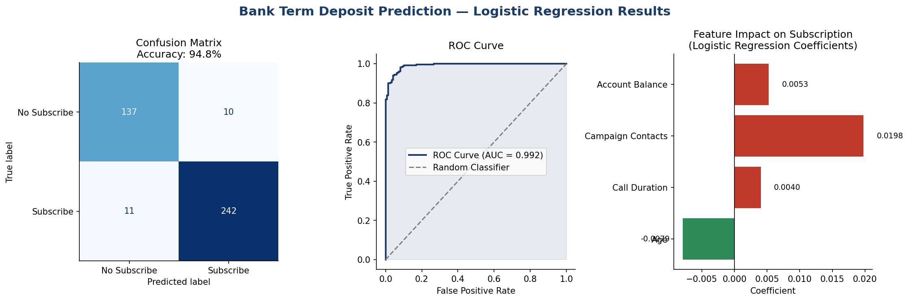

# 🏦 Bank Term Deposit Subscription Prediction — Logistic Regression

> Predicting whether a bank customer will subscribe to a term deposit using Logistic Regression on a real-world Portuguese bank marketing dataset.


---

## 🎯 Problem Statement

A Portuguese bank ran a phone-based marketing campaign offering term deposit subscriptions. The goal is to predict whether a **customer will say YES or NO** to subscribing — enabling the bank to target high-probability customers and reduce wasted calls.

**Target column:** `y` → Did the customer subscribe? (yes/no)

---

## 📋 Dataset Overview

| Property | Value |
|---|---|
| Rows | 41,199 |
| Columns | 21 |
| Source | Bank Marketing Dataset (UCI / Kaggle) |
| Task | Binary Classification |

### Key Features

| Feature | Description |
|---|---|
| `age` | Customer age |
| `job` | Occupation type |
| `marital` | Marital status |
| `education` | Education level |
| `default` | Has bad credit history? |
| `housing` | Has a home loan? |
| `loan` | Has personal loan? |
| `contact` | Communication type |
| `duration` | Last contact duration |
| `campaign` | Number of contacts in this campaign |

---

## 🔬 ML Pipeline

```
Data Loading → EDA → Cleaning (nulls, duplicates) → 
Outlier Detection (boxplots) → Label Encoding → 
Train/Test Split → Logistic Regression → Evaluation
```

---

## 📁 Project Structure

```
bank-deposit-prediction/
├── bank_deposit_prediction.ipynb    # Full notebook (84 cells)
└── README.md                        # Documentation
```

---

## 🛠️ Tech Stack

- **Python 3.x**
- **Pandas & NumPy** — data handling
- **Matplotlib & Seaborn** — boxplots, count plots
- **Scikit-learn** — LogisticRegression, metrics, preprocessing

---

## 🚀 How to Run

```bash
git clone https://github.com/sidducv0528/bank-deposit-prediction.git
cd bank-deposit-prediction
pip install pandas numpy matplotlib seaborn scikit-learn jupyter
jupyter notebook bank_deposit_prediction.ipynb
```

> **Dataset:** Bank Marketing Dataset — [View Dataset](https://drive.google.com/file/d/19O3hzFSf5Rr2QCO-Kn0lpUoZrDRnGbUD/view)

---

## 👤 Author

**Siddu Varikuppala**
- 🎓 B.Sc (Honours) | Data Science Enthusiast | Hyderabad
- 💼 [LinkedIn](https://www.linkedin.com/in/siddu-data/)
- 💻 [GitHub](https://github.com/sidducv0528)

---

> *Part of my Data Science & ML portfolio — trained under IIT Roorkee Data Science Programme (Intellipaat)*

---


---

## 📂 Dataset Included

| File | Rows | Columns | Description |
|---|---|---|---|
| `bank_marketing_sample.csv` | 500 | 15 | Sample bank marketing data — ready to run! |

**Full dataset:** [Bank Marketing Dataset — Kaggle](https://www.kaggle.com/henriqueyamahata/bank-marketing)

## 📸 Output Screenshots



*Charts showing: Confusion matrix (Accuracy: 94.8%), ROC Curve (AUC=0.992), Feature impact coefficients*
